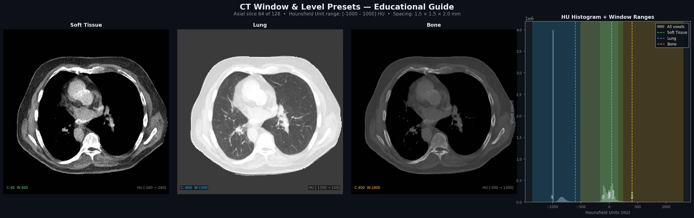

# MAISI-RT Quick Start Guide

**Generate synthetic CT and MRI scans in a single command — no medical imaging experience required.**


> **Safety note:** Every image produced by this tool is 100% synthetic — generated by AI, not derived from any real patient. These images are for research, education, and AI prototyping only. They must not be used for diagnosis, treatment planning, or any clinical purpose.

---

## Before You Start

You need three things:

| Requirement | What it is | Where to get it |
|---|---|---|
| Python 3.10+ | The programming language | [python.org](https://python.org) |
| A working MAISI_venv | The Python environment with all libraries | Run the setup below |
| NVIDIA GPU + model weights | Required only to *generate* new scans | NVIDIA NGC (see setup notes) |

**No GPU? No problem.** The tutorials and visualization tools work entirely on pre-generated files that are already in the `outputs/` folder. You can explore, visualize, and learn without ever touching a GPU.

---

## One-Time Setup

```bash
# 1. Go to the project folder
cd Musti_MAISI_Project

# 2. Activate the Python environment
source MAISI_venv/bin/activate

# 3. Confirm it works
python MAISI_RT_Generate.py --list
```

You should see a list of 16 generation presets printed to the screen. If that works, you are ready.

---

## Generate Something in 60 Seconds

### Option A — Interactive menu (recommended for first-timers)

```bash
source MAISI_venv/bin/activate
python MAISI_RT_Generate.py
```

The script will show you a numbered menu like this:

```
══════════════════════════════════════════════════════════════
  MAISI-RT Sandbox  —  Quick Generate
  Synthetic CT / MRI with NVIDIA MAISI v2
══════════════════════════════════════════════════════════════

  What would you like to generate?

  CT with segmentation masks
  ────────────────────────────────────────────────────────
  [ 1]  Chest  — all lung lobes + lung tumor + heart + trachea
  [ 2]  Abdomen — liver, spleen, pancreas, kidneys, aorta, gallbladder, stomach
  [ 3]  Abdomen — organs (above) + hepatic tumor + pancreatic tumor
  [ 4]  Head & Neck — brain, skull, spinal cord, carotid arteries, thyroid, trachea
  [ 5]  Pelvis RT — bladder, prostate, femur, hip bones, sacrum
  [ 6]  Chest cardiovascular — heart, aorta, great vessels, lungs, airway
  [ 7]  Spine — spinal cord + full vertebral column C1–L5 + sacrum

  Brain MRI
  ────────────────────────────────────────────────────────
  [ 8]  Brain MRI — T1-weighted whole brain
  [ 9]  Brain MRI — T2-weighted whole brain
  [10]  Brain MRI — FLAIR whole brain  (fluid suppression, lesion detection)
  [11]  Brain MRI — SWI whole brain  (susceptibility weighted imaging)
  [12]  Brain MRI — T1 skull-stripped  (brain tissue only, no skull)
  [13]  Brain MRI — All contrasts  (T1, T2, FLAIR, SWI + skull-stripped = 8 volumes)

  Body MRI
  ────────────────────────────────────────────────────────
  [14]  Body MRI — Prostate T2  (high-resolution pelvic MRI)
  [15]  Body MRI — Breast T1  (bilateral breast MRI)
  [16]  Body MRI — Abdomen T1  (upper abdominal MRI)
```

Type a number and press Enter. The script will ask for a seed (just press Enter for random) and your GPU index, then start generating.

---

### Option B — Direct preset (fastest, no menu)

```bash
# CT chest with lung lobes and lung tumor masks
python MAISI_RT_Generate.py --preset ct_lungs_tumor

# T1-weighted whole brain MRI
python MAISI_RT_Generate.py --preset brain_t1

# Set a specific seed for reproducibility
python MAISI_RT_Generate.py --preset ct_abdomen_organs --seed 42001

# Use GPU 0 instead of the default GPU 1
python MAISI_RT_Generate.py --preset brain_flair --gpu 0
```

### Option C — Write the config, don't run yet

Use `--dry-run` to write the YAML configuration file and see the exact command that would run, without using the GPU. Useful for inspecting settings before committing.

```bash
python MAISI_RT_Generate.py --preset ct_pelvis_rt --dry-run
```

---

## What Gets Generated

After a successful run, your files appear in `outputs/quickgen_<preset>/`.

### CT with segmentation masks

```
outputs/quickgen_ct_lungs_tumor/
  visuals/
    sample_001_seed12345/
      ct_seed12345_image.nii.gz          ← The CT scan (3D volume)
      ct_seed12345_label.nii.gz          ← Structure masks (which voxel = which organ)
      ct_orthogonal_panel.png            ← Three-plane slice view
      ct_random_axial_4x4.png            ← 16 random axial slices
      ct_random_coronal_4x4.png          ← 16 random coronal slices
      ct_random_sagittal_4x4.png         ← 16 random sagittal slices
      ct_structure_overlay_axial_4x4.png ← CT + coloured organ masks overlaid
      ct_sweep_axial_4x4.png             ← Evenly spaced sweep through the volume
    all_ct_samples_overview.png          ← Summary contact sheet
```

### Brain and body MRI

```
outputs/quickgen_brain_t1/
  rflow-mr-brain_mri_t1_seed12345_*.nii.gz   ← The MRI volume
  visuals/
    sample_001_seed12345/
      orthogonal_panel.png               ← Three-plane slice view
      random_axial_4x4.png               ← 16 random axial slices
      sweep_axial_4x4.png                ← Evenly spaced sweep
    all_samples_orthogonal_overview.png  ← Summary contact sheet
```

The `.nii.gz` files are NIfTI format — the standard 3D medical image format used by radiologists, physicists, and AI researchers worldwide.

---

## Viewing Your Images

### In your terminal (instant)

The PNG files are created automatically after every generation run. Open them with any image viewer. The `ct_structure_overlay_axial_4x4.png` file is especially useful — it shows the CT scan with coloured masks overlaid so you can immediately see which organs were generated and where they are.


### Animated slice sweeps

Animated GIFs are available showing a sweep through the volume:

| File | What it shows |
|---|---|
| `figures/gif1_brain_t1_axial_sweep.gif` | Axial sweep through a T1 brain |
| `figures/gif2_ct_lung_tumor_sweep.gif` | Axial sweep through a CT chest with lung tumor |
| `figures/gif3_brain_contrast_comparison.gif` | Same brain, different MRI contrasts side by side |

To regenerate them after a new run:

```bash
source MAISI_venv/bin/activate
python scripts/make_animated_gifs.py
```

### In 3D Slicer (best experience — free download)

3D Slicer is a free medical image viewer used worldwide by researchers and clinicians. It lets you explore your volumes in full 3D, adjust windows, and inspect segmentation masks properly.

1. Download from [slicer.org](https://www.slicer.org) — free, no account needed
2. Open Slicer
3. Drag your `ct_seed*_image.nii.gz` file into the Slicer window → you see the CT
4. Drag your `ct_seed*_label.nii.gz` into the same window → choose **Segmentation** when asked
5. In the Segment Editor, adjust opacity to overlay the masks on the CT

---

## Understanding What You're Looking At

### CT scans — the numbers behind the image

Every voxel (3D pixel) in a CT scan has a value called a **Hounsfield Unit (HU)**. These are not arbitrary — they have a fixed physical meaning:

| Tissue | HU range | Appears as |
|---|---|---|
| Air | −1000 | Black |
| Fat | −100 to −50 | Dark grey |
| Water / fluid | ~0 | Medium grey |
| Soft tissue (muscle, organs) | +20 to +80 | Mid grey |
| Cancellous bone | +300 to +700 | Light grey / white |
| Cortical bone | +700 to +1900 | Bright white |



**Why does the same CT look completely different when I change the "window"?**

Because monitors can only show 256 shades of grey, but CT data spans ~3000 HU values. A **window** maps a chosen HU range onto those 256 shades. Everything below the range goes black; everything above goes white.

| Window preset | Centre (HU) | Width (HU) | Best for seeing |
|---|---:|---:|---|
| Soft tissue | 40 | 400 | Organs, muscles, tumors |
| Lung | −600 | 1500 | Airways, lung parenchyma |
| Bone | 400 | 1800 | Skeleton, vertebrae |

Radiologists switch between these constantly when reading a CT. You will see all three in the tutorial notebooks.

### Segmentation masks — the coloured label files

The `_label.nii.gz` file is a 3D map where each voxel holds an integer that identifies which structure it belongs to. Label 0 means background; label 23 means lung tumor; label 115 means heart, and so on. The full list is in `docs/config_value_reference.md`.

When the overlay visualisation colours your scan, it reads this file and paints each labelled region a different colour. **This is exactly what clinical AI segmentation models produce** — and one of the main reasons synthetic labelled data is valuable for training them.

### MRI contrasts — same organ, completely different look

Unlike CT, MRI signals depend on the scanning sequence, not a fixed physical scale. Different sequences highlight different tissue properties:

| Contrast | What tissue looks bright | Main clinical use |
|---|---|---|
| **T1** | Fat, white matter, enhancing lesions | Anatomy, post-contrast enhancement |
| **T2** | Water, CSF, most pathology | Oedema, lesions, fluid collections |
| **FLAIR** | Like T2 but CSF is suppressed (dark) | White matter lesions, periventricular disease |
| **SWI** | Susceptibility effects (blood, iron, calcium) | Micro-bleeds, venous structures |

T1-skull-stripped variants have the skull removed algorithmically — standard preprocessing for brain AI pipelines.


The same brain looks strikingly different in each contrast. Changing the `--preset` between `brain_t1`, `brain_t2`, `brain_flair`, and `brain_swi` and then comparing them side by side is one of the most educational exercises you can do with this tool.

---

## All 16 Presets — What They Generate and Why They're Useful

### CT with segmentation masks

| Preset | Structures generated | Why it's useful |
|---|---|---|
| `ct_lungs_tumor` | 5 lung lobes, lung tumor, heart, trachea | Lung cancer AI, radiation therapy planning, pulmonary research |
| `ct_abdomen_organs` | Liver, spleen, pancreas, both kidneys, aorta, IVC, gallbladder, stomach, esophagus, duodenum | Abdominal organ segmentation, surgical planning |
| `ct_abdomen_tumor` | Same as above + hepatic tumor + pancreatic tumor | Oncology AI, tumor detection training data |
| `ct_head_neck` | Brain, skull, spinal cord, carotid arteries, thyroid, trachea | Head & neck radiation therapy, stroke imaging |
| `ct_pelvis_rt` | Bladder, prostate, femur, hip bones, sacrum | Prostate radiation therapy — the most common RT target |
| `ct_chest_cardio` | Heart, aorta, pulmonary vein, SVC, all lung lobes, trachea, airway | Cardiac imaging, cardiothoracic AI |
| `ct_spine` | Spinal cord + all 26 vertebrae (C1–L5 + S1) | Spine surgery planning, vertebral fracture AI |

### Brain MRI

| Preset | Contrast | Why it's useful |
|---|---|---|
| `brain_t1` | T1 whole brain | Standard anatomy, brain atlas registration |
| `brain_t2` | T2 whole brain | Lesion detection, oedema |
| `brain_flair` | FLAIR whole brain | Multiple sclerosis, white matter disease |
| `brain_swi` | SWI whole brain | Haemorrhage, venous anatomy |
| `brain_t1_stripped` | T1 skull-stripped | Direct input to most brain AI models |
| `brain_all` | All 8 contrasts at once | Multi-contrast studies, contrast harmonisation |

### Body MRI

| Preset | What it generates | Why it's useful |
|---|---|---|
| `mr_prostate_t2` | High-resolution pelvic T2 MRI | Prostate cancer staging AI |
| `mr_breast_t1` | Bilateral breast T1 MRI | Breast density, lesion detection |
| `mr_abdomen_t1` | Upper abdominal T1 MRI | Liver, pancreas, kidney MRI studies |

---

## Reproducibility — Using Seeds

Every generation run uses a random seed to initialise the AI model. The same seed + same preset = the same image every time.

```bash
# Generate once
python MAISI_RT_Generate.py --preset brain_t1 --seed 20260522

# Generate again with the same seed → identical output
python MAISI_RT_Generate.py --preset brain_t1 --seed 20260522
```

Use different seeds to generate a dataset of diverse synthetic cases:

```bash
python MAISI_RT_Generate.py --preset ct_lungs_tumor --seed 10001
python MAISI_RT_Generate.py --preset ct_lungs_tumor --seed 10002
python MAISI_RT_Generate.py --preset ct_lungs_tumor --seed 10003
```

Each seed produces a different patient-like anatomy with the same set of structures labelled.

---

## Generating Multiple Cases (Dataset Mode)

To build a small synthetic dataset, run the preset multiple times with different seeds. The outputs go to the same folder and each case gets its own `sample_00N_seed<N>/` subfolder.

You can also edit the generated YAML config file directly. For example, after a `--dry-run`:

```yaml
# configs/maisi2/quickgen_ct_lungs_tumor.yaml
ct_structures:
  seeds: [10001, 10002, 10003, 10004, 10005]   # ← add multiple seeds here
```

Then run the underlying script directly:

```bash
python scripts/run_nvidia_ct_structures_from_config.py \
       --config configs/maisi2/quickgen_ct_lungs_tumor.yaml
```

This generates all 5 cases in one GPU run.

---

## Using the Jupyter Tutorials (No GPU Required)

If you want to learn about the generated images before running any GPU jobs, the tutorial notebooks work entirely on the existing files in `outputs/`.

```bash
source MAISI_venv/bin/activate
jupyter notebook tutorials/
```

| Notebook | What you learn |
|---|---|
| `00_getting_started.ipynb` | Load and display CT and MRI, understand the project layout |
| `01_ct_deep_dive.ipynb` | HU windows, structure masks, organ volume calculations, quick QA |
| `02_brain_mri_exploration.ipynb` | MRI contrasts, seed diversity, three-plane views, animated sweeps |
| `03_generation_recipe_cookbook.ipynb` | Choose a recipe, inspect FOV, prepare safe GPU commands |

These notebooks have commentary cells that explain every step. They are designed to be read top-to-bottom, even if you never run the code cells yourself.

---

## Common Questions

**The generation failed immediately.**
Check that your NVIDIA model weights are downloaded. See `docs/nvidia_setup_notes.md`. The weights must be in `external/NV-Generate-CTMR/` before any generation can run.

**The output looks blurry or anatomically odd.**
This is a known characteristic of generative models at moderate resolution. The default `output_size` and `spacing` settings are chosen to be fast and educational. For higher quality, edit the generated YAML and use the larger `output_size` and finer `spacing` values from `docs/maisi2_generation_guide.md`.

**I want structures that aren't in any preset.**
Run `--dry-run` on the nearest preset to get a starting YAML, then open the file and edit `anatomy_list` directly. The full list of valid structure names is in `docs/config_value_reference.md`.

**How long does generation take?**
Roughly 3–8 minutes per sample on a modern GPU (NVIDIA A100 / H100 class). The MAISI-v2 rectified flow models use only 30 inference steps — much faster than the 1000-step MAISI-v1 models.

**Can I use these images to train a real clinical AI model?**
Only with proper validation. Synthetic images can augment training data but the resulting model must be validated on real clinical images before any clinical use.

---

## Quick Reference Card

```
python MAISI_RT_Generate.py                          → interactive menu
python MAISI_RT_Generate.py --list                   → see all 16 presets
python MAISI_RT_Generate.py --preset <name>          → run a preset
python MAISI_RT_Generate.py --preset <name> --seed N → reproducible run
python MAISI_RT_Generate.py --preset <name> --gpu N  → choose GPU
python MAISI_RT_Generate.py --preset <name> --dry-run → write config only

Outputs always go to:   outputs/quickgen_<preset>/
Config is written to:   configs/maisi2/quickgen_<preset>.yaml
View images:            any PNG viewer, or 3D Slicer (slicer.org)
```

---

*This guide covers `MAISI_RT_Generate.py`. For the full project documentation, see `README.md` and the `docs/` folder.*
