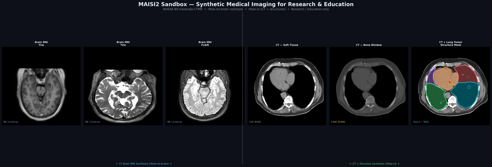
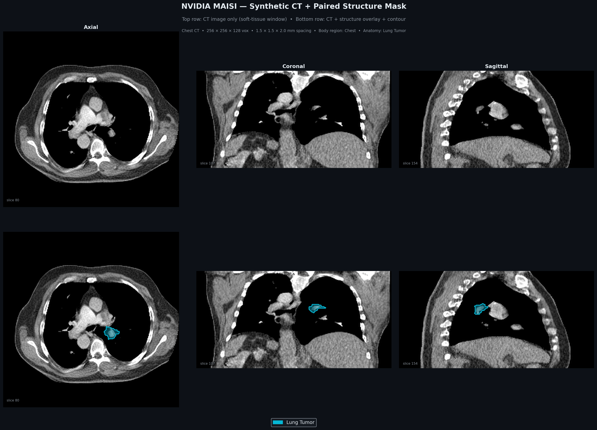
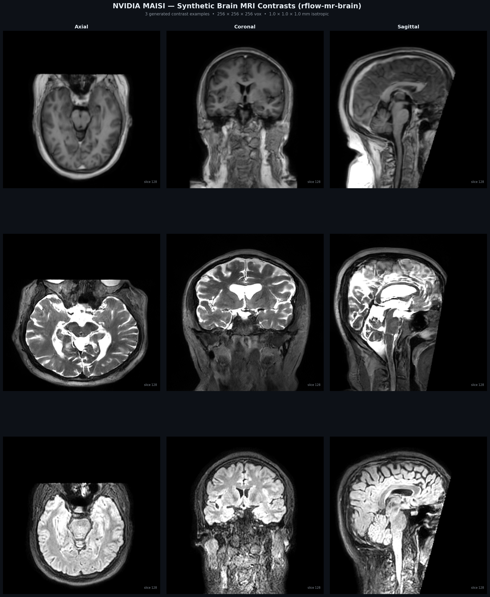
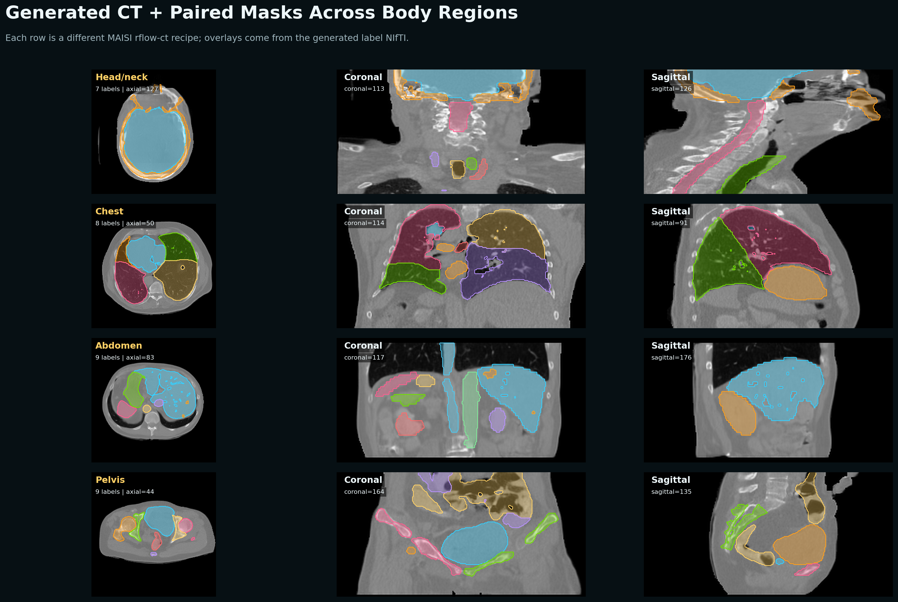

# MAISI-RT Sandbox

[](https://www.python.org)
[](LICENSE)

**A low-barrier framework for generating synthetic CT and MRI volumes with NVIDIA MAISI — built for learners, researchers, and AI developers who want labeled medical imaging data without a clinical dataset.**



> **Clinical disclaimer:** This repository is for research, education, visualization, and AI prototyping only. It is not a medical device and must not be used for diagnosis, treatment planning, dose calculation, patient-specific QA, or clinical decision-making.

---

## The idea in one sentence

You pick what you want to generate from a menu, press Enter, and get a NIfTI file plus labeled segmentation masks and PNG visualizations — no YAML editing, no prior medical imaging knowledge required.

---

## Start in 60 seconds

```bash
# 1. Activate the environment
source MAISI_venv/bin/activate

# 2. See everything you can generate
python MAISI_RT_Generate.py --list

# 3. Generate something (interactive menu — no arguments needed)
python MAISI_RT_Generate.py
```

Or go directly by name:

```bash
python MAISI_RT_Generate.py --preset ct_lungs_tumor    # CT chest + lung tumor mask
python MAISI_RT_Generate.py --preset brain_t1          # T1 whole brain MRI
python MAISI_RT_Generate.py --preset ct_abdomen_organs # 11 abdominal structures
```

For the full step-by-step guide including setup, visualization, and dataset building → **[QUICKSTART.md](QUICKSTART.md)**

---

## What you can generate — 16 presets across 3 categories

### CT with segmentation masks

| Preset | Structures in the mask |
|---|---|
| `ct_lungs_tumor` | All 5 lung lobes, lung tumor, heart, trachea |
| `ct_abdomen_organs` | Liver, spleen, pancreas, both kidneys, aorta, IVC, gallbladder, stomach, esophagus, duodenum |
| `ct_abdomen_tumor` | Same as above + hepatic tumor + pancreatic tumor |
| `ct_head_neck` | Brain, skull, spinal cord, carotid arteries, thyroid, trachea |
| `ct_pelvis_rt` | Prostate, bladder, femur, hip bones, sacrum, colon |
| `ct_chest_cardio` | Heart, aorta, great vessels, all lung lobes, trachea, airway |
| `ct_spine` | Spinal cord + full vertebral column C1–L5 + sacrum |

CT masks use NVIDIA's **132-class segmentation vocabulary** and are generated simultaneously with the CT volume using the MAISI-v2 rectified-flow model (`rflow-ct`).



### Brain MRI

| Preset | Contrast |
|---|---|
| `brain_t1` | T1-weighted whole brain |
| `brain_t2` | T2-weighted whole brain |
| `brain_flair` | FLAIR whole brain (fluid suppression) |
| `brain_swi` | SWI whole brain (susceptibility weighted) |
| `brain_t1_stripped` | T1 skull-stripped (brain tissue only) |
| `brain_all` | All 8 contrasts in one run (T1, T2, FLAIR, SWI + skull-stripped variants) |



### Body MRI

| Preset | What it generates |
|---|---|
| `mr_prostate_t2` | High-resolution prostate T2 MRI (169 × 169 × 90 mm FOV) |
| `mr_breast_t1` | Bilateral breast T1 MRI |
| `mr_abdomen_t1` | Upper abdominal T1 MRI |

---

## Export to DICOM RT-STRUCT — clinical format for TPS import

Convert any generated CT + label pair into a **DICOM CT series + RT-STRUCT** file, loadable directly in 3D Slicer, Eclipse, RayStation, and Monaco:

```bash
# Export by preset name (finds the latest output automatically)
python scripts/export_rt_struct.py --preset ct_pelvis_rt

# Export from an explicit output directory
python scripts/export_rt_struct.py --pair outputs/maisi2_showcase_ct_pelvis_rt/visuals/sample_001_seed73001/

# List all exportable outputs
python scripts/export_rt_struct.py --list
```

Output structure:

```text
outputs/dicom_export/<name>/
  CT/            ← DICOM CT series (one .dcm per axial slice)
  RT/
    RS_<name>.dcm  ← DICOM RT-STRUCT (named, colour-coded ROIs)
  manifest.json  ← per-structure volumes (mL) + QUANTEC dose constraint notes
```

Each exported structure gets the **clinical colour convention** used in Eclipse/RayStation (e.g. spinal cord = yellow, prostate = blue, femoral heads = purple) and a QUANTEC/TG-101 dose limit note in the manifest.

This is not available in the original NVIDIA MAISI repository — it bridges synthetic generation and clinical radiotherapy workflow.

---

## Learn without a GPU — 6 interactive tutorials

All five tutorials run on **pre-generated data already in `outputs/`**. No GPU, no setup beyond activating the environment.

```bash
source MAISI_venv/bin/activate
jupyter notebook tutorials/
```

| Notebook | What you learn |
|---|---|
| [01_ct_first_look.ipynb](tutorials/01_ct_first_look.ipynb) | Load a CT scan, view all three anatomical planes, understand Hounsfield Units, read an HU histogram |
| [02_ct_windows_and_tissues.ipynb](tutorials/02_ct_windows_and_tissues.ipynb) | Why the same CT looks different with different windows, soft-tissue / lung / bone presets, HU fingerprints across body regions |
| [03_ct_segmentation_masks.ipynb](tutorials/03_ct_segmentation_masks.ipynb) | Load label files, build CT + overlay visualizations, measure organ volumes in mL, compare structures across all four body regions |
| [04_brain_mri_contrasts.ipynb](tutorials/04_brain_mri_contrasts.ipynb) | T1 vs T2 vs FLAIR vs SWI side-by-side, T1−T2 difference maps, skull-stripped comparison, signal intensity profiles |
| [05_generate_your_own.ipynb](tutorials/05_generate_your_own.ipynb) | Use `MAISI_RT_Generate.py` from inside a notebook, inspect and modify YAML configs, explore all 132 anatomy structures, build a multi-seed dataset config |
| [06_rt_struct_export.ipynb](tutorials/06_rt_struct_export.ipynb) | Export synthetic CT + masks to DICOM RT-STRUCT; inspect DICOM metadata; load in 3D Slicer; read QUANTEC constraint notes from the manifest |

The tutorials are designed to be read top-to-bottom even without running any code. Every step has a plain-English explanation.

---

## What every generation produces

```text
outputs/quickgen_<preset>/
  visuals/
    sample_001_seed<N>/
      ct_seed<N>_image.nii.gz          ← CT volume (HU values)
      ct_seed<N>_label.nii.gz          ← structure masks (integer labels, CT only)
      ct_orthogonal_panel.png           ← 3-plane PNG — instant QA
      ct_random_axial_4x4.png           ← 16 random axial slices
      ct_structure_overlay_axial_4x4.png ← CT + colour-coded organ masks
      ct_sweep_axial_4x4.png            ← evenly spaced axial sweep
    all_ct_samples_overview.png         ← contact sheet across all seeds
```

For MRI runs, you get the same PNG galleries but without a label file (MRI presets are image-only).



---

## Animated visualizations

Three animated GIF sweeps are pre-generated in `figures/`:

| File | What it shows |
|---|---|
| `gif1_brain_t1_axial_sweep.gif` | Axial sweep through a T1 brain MRI |
| `gif2_ct_lung_tumor_sweep.gif` | Axial sweep through a chest CT with lung tumor |
| `gif3_brain_contrast_comparison.gif` | Same brain, T1 / T2 / FLAIR / SWI side-by-side |

Regenerate after new outputs with:

```bash
source MAISI_venv/bin/activate
python scripts/make_animated_gifs.py
python scripts/make_showcase_figures.py
```

---

## One-time setup

```bash
# Clone
git clone https://github.com/mustikazim/maisi-rt-sandbox
cd maisi-rt-sandbox

# Create Python environment
python -m venv MAISI_venv
source MAISI_venv/bin/activate
python -m pip install --upgrade pip

# Install dependencies
pip install nibabel numpy matplotlib pyyaml pillow scipy scikit-image rich typer pydantic jupyter

# Clone NVIDIA's official model code
mkdir -p external
git clone https://github.com/NVIDIA-Medtech/NV-Generate-CTMR.git external/NV-Generate-CTMR
pip install -r external/NV-Generate-CTMR/requirements.txt
```

### Download model weights (GPU generation only)

```bash
cd external/NV-Generate-CTMR

# Brain MRI (T1, T2, FLAIR, SWI)
python -m scripts.download_model_data --version rflow-mr-brain --root_dir ./ --model_only

# CT image-only and CT + paired mask
python -m scripts.download_model_data --version rflow-ct --root_dir ./

# Body MRI (prostate, breast, abdomen)
python -m scripts.download_model_data --version rflow-mr --root_dir ./ --model_only

cd ../..
```

Model weights are governed by NVIDIA's own licenses and terms of service.

---

## The MAISI_RT_Generate.py script — how it works

The script has three modes:

```bash
python MAISI_RT_Generate.py                          # interactive numbered menu
python MAISI_RT_Generate.py --list                   # print all 16 preset keys
python MAISI_RT_Generate.py --preset NAME            # run a named preset
python MAISI_RT_Generate.py --preset NAME --seed N   # reproducible run
python MAISI_RT_Generate.py --preset NAME --gpu N    # choose GPU index
python MAISI_RT_Generate.py --preset NAME --dry-run  # write YAML only, no GPU
```

Internally, `--dry-run` writes a complete YAML config to `configs/maisi2/quickgen_<preset>.yaml`. Inspect and modify that file before running if you want to add structures or change the resolution. Advanced users can also pass the config directly to the underlying generation scripts — see [docs/maisi2_generation_guide.md](docs/maisi2_generation_guide.md).

---

## Key concepts for new users

### Hounsfield Units (CT only)

CT voxel values have a fixed physical meaning:

| Tissue | HU range | Appears as |
|---|---:|---|
| Air | −1000 | Black |
| Fat | −100 to −50 | Dark grey |
| Water / fluid | ~0 | Medium grey |
| Soft tissue | +20 to +80 | Grey |
| Bone | +300 to +1900 | White |

### MRI contrasts

MRI values are not physically calibrated — they depend on the pulse sequence. Each contrast highlights different tissue properties:

| Contrast | What is bright | Key clinical use |
|---|---|---|
| T1 | White matter, fat | Anatomy, post-contrast enhancement |
| T2 | Water, CSF, oedema | Lesions, fluid collections |
| FLAIR | Lesions (CSF suppressed) | White matter disease |
| SWI | Susceptibility effects | Micro-bleeds, venous anatomy |

### The field-of-view rule

```
FOV in mm = output_size × spacing
```

Stay close to the anatomy's real physical size. Do not use small debug volumes — they produce out-of-distribution images that look anatomically wrong.

| Preset group | output_size | spacing (mm) | FOV (mm) |
|---|---|---|---|
| Brain MRI | 256 × 256 × 256 | 1.0 × 1.0 × 1.0 | 256 × 256 × 256 |
| CT (chest/abdomen/pelvis) | 256 × 256 × 128 | 1.5 × 1.5 × 2.0 | 384 × 384 × 256 |
| Prostate T2 MRI | 256 × 256 × 128 | 0.66 × 0.66 × 0.70 | 169 × 169 × 90 |

---

## View in 3D Slicer

Generated `.nii.gz` files load directly into [3D Slicer](https://www.slicer.org) (free, no account needed):

1. Drag `ct_seed*_image.nii.gz` into the Slicer window → loaded as a volume
2. Drag `ct_seed*_label.nii.gz` → choose **Segmentation**
3. Adjust opacity in the Segment Editor to overlay masks on the CT

See [docs/slicer_loading_guide.md](docs/slicer_loading_guide.md) for step-by-step screenshots.

---

## Repository layout

```text
MAISI_RT_Generate.py    ← start here — interactive generation menu (16 presets)
QUICKSTART.md           ← step-by-step guide for new users

configs/maisi2/         ← YAML generation configs (auto-generated by the script)
docs/                   ← setup notes, model card, anatomy reference, limitations
external/               ← NVIDIA NV-Generate-CTMR clone (not vendored)
figures/                ← showcase PNGs and animated GIFs
outputs/                ← generated NIfTI volumes and visual QA galleries
tutorials/              ← 5 Jupyter notebooks (no GPU needed)
```

---

## Known limitations

- Synthetic anatomy can be unrealistic or anatomically implausible in some seeds.
- Generated masks are not clinician-approved contours and require validation before research use.
- CT HU values and MRI intensities may differ from real scanner distributions.
- Quality depends on field of view, spacing, anatomy list, model variant, and seed.
- Model weights and generated outputs are governed by NVIDIA's licenses and terms.

See [docs/limitations.md](docs/limitations.md) for the full list.

---

## Citation

```bibtex
@software{maisi_rt_sandbox,
  author = {Kazim, Musti},
  title  = {MAISI-RT Sandbox},
  year   = {2026},
  url    = {https://github.com/mustikazim/maisi-rt-sandbox},
  note   = {Low-barrier synthetic CT/MR generation framework built on NVIDIA MAISI / NV-Generate-CTMR}
}
```

For NVIDIA citations, follow the official [NV-Generate-CTMR repository](https://github.com/NVIDIA-Medtech/NV-Generate-CTMR).

---

## License

This framework is Apache 2.0. See [LICENSE](LICENSE).

NVIDIA code, model weights, and generated data are governed by NVIDIA's own terms.
